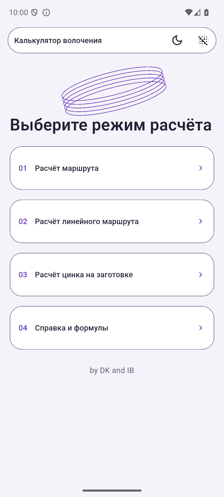
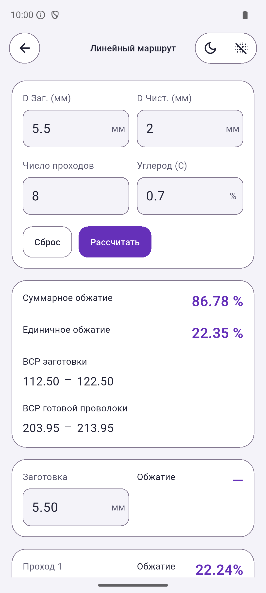
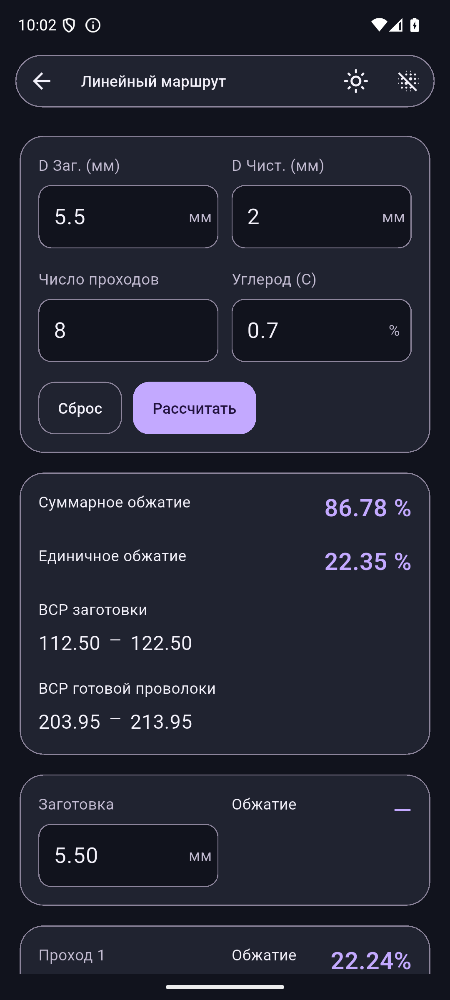
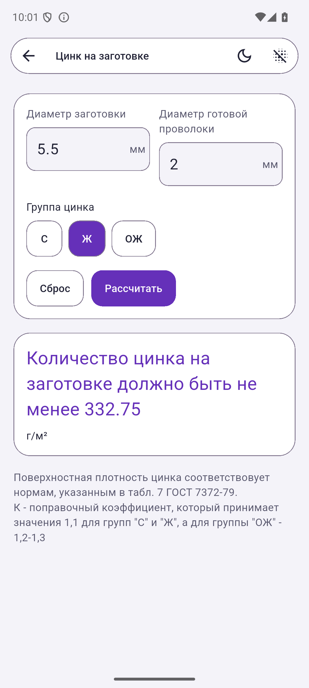
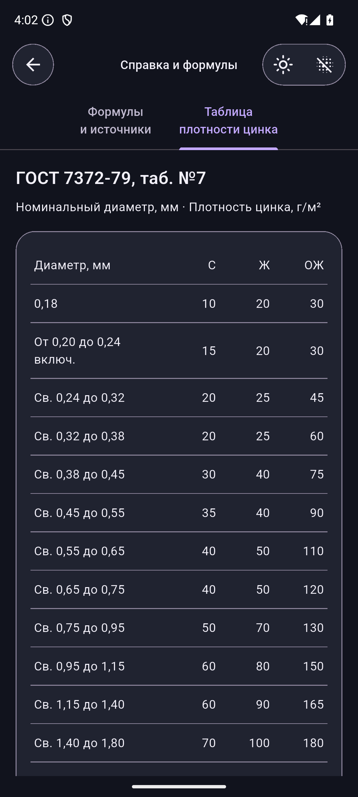

  

<h1 align="center">Dragging</h1>

<strong>Маршрут волочения</strong> Калькулятор диаметров, обжатий и цинкового покрытия для Android.

  <a href="https://github.com/Abynarc/Dragging/releases/tag/v3.1.1"><strong>Скачать приложение →</strong></a>

## О приложении

Dragging помогает рассчитать путь от заготовки до готовой проволоки. Все расчёты доступны без интернета, а светлая и тёмная темы позволяют выбрать удобное оформление.

- **Маршрут волочения** — ввод диаметров заготовки и блоков с автоматическим расчётом обжатия между проходами.
- **Линейный маршрут** — последовательность диаметров, суммарное и единичное обжатие, ВСР и ручная корректировка проходов.
- **Цинковое покрытие** — расчёт количества цинка на заготовке для групп С, Ж и ОЖ.
- **Справка** — формулы и таблица плотности цинка под рукой.

Интерфейс Precision Glass, крупные поля с единицами измерения, поддержка десятичной точки и запятой. Тему и прозрачность можно переключать прямо в приложении.

## Скриншоты

<table>
  <tr><th>Светлая тема</th><th>Тёмная тема</th></tr>
  <tr>
    <td align="center"></td>
    <td align="center"></td>
  </tr>
  <tr><th colspan="2">Линейный маршрут — ввод и результаты</th></tr>
  <tr>
    <td align="center"></td>
    <td align="center"></td>
  </tr>
  <tr><th>Расчёт цинка</th><th>Справочная таблица</th></tr>
  <tr>
    <td align="center"></td>
    <td align="center"></td>
  </tr>
</table>

